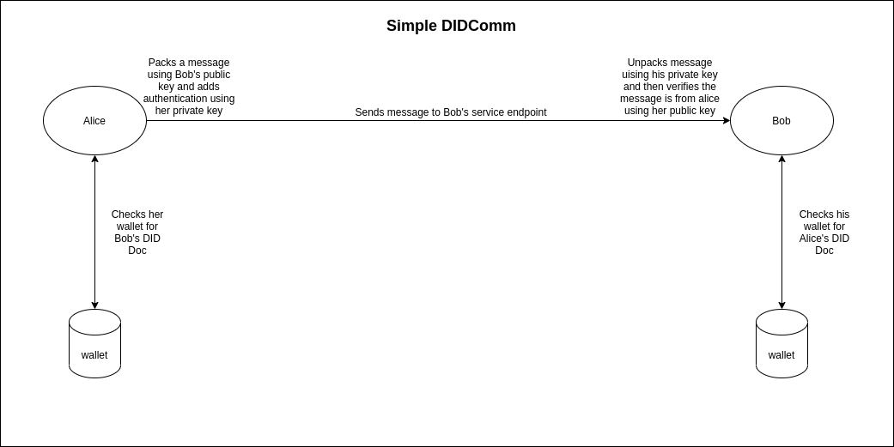

# What is DIDComm ?

Secure, private communication methodology on top of decentralised identifiers.

  

## Disadvantages of present system

* Present communication systems that offer security relies on central systems like key registeries, identity providers, certificate authorities, browser or app vendors.
* Usually tied to single transport for e.g. HTTP, Bluetooth
* Poor interoperability
* Users suffer with usernames and passwords
* Choice between privacy and convenience

## What does DIDComm offer ?

* Can convert your mobile devices as full peers of HA webservers
* Intermediaries require no trust
* No terms and conditions

## Goals and ramifications

* **Secure**
  * Tamper proof
  * Best crypto algorithms should be employed
  * Allows users to talk on and off the record
* **Private**
  * Third party can't understand who's communicating and when
  * Sender can be anonymous to the recipient
* **Decentralized**
  * Trust for encryption, signing, authentication, authorization is obtained from control of the DIDs rather than from centralised oracles like CAs, IDPs
  * Usable at the edges
* **Transport-agnostic**
  * Usables over HTTPS 1.X and 2.0, WebSockets, BlueTooth, chat, push notifications, AMQP, SMTP, NFC e.t.c
  * Supports both simplex, duplex
  * works offline
  * allows pairwise, n-wise or public broadcast usage
* **Routable**
  * A can talk to B without direct connection to B
  * Allows mixed and dynamic transports
  * Can pass through mix networks and generic infrastructure that sees only payload BLOBs -> this is to gain proper anonymity ? e.g. Onion routing in TOR networks
* **Interoperable**
  * Works across programming languages, blockchains, vendors, OS/platforms, networks, legal jurisdictions, geos, cryptographies, and hardware - as well as across time; avoids vendor lock-in
* **Extensible**
  * Customise easily
  * Facilitates higher level protocols on top of DIDComm that can inherit all the properties of DIDComm
* **Efficient**

# References

1. https://identity.foundation/didcomm-messaging/spec/